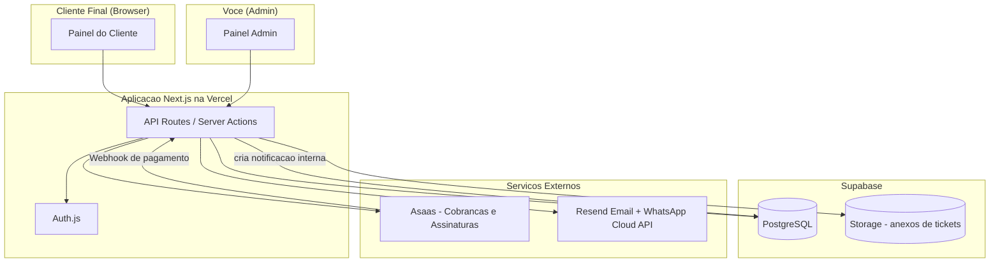

# Painel de Gestão de Sites — Plano do Projeto

## 1. Visão Geral do Produto

Um painel SaaS que administra o relacionamento inteiro com o cliente que comprou um
mini site (R$ 97), desde a entrega até os upsells recorrentes. O painel tem dois lados:

- **Painel do Cliente**: status do site, domínio, SSL, desempenho, histórico,
  solicitação de manutenção do site, notificações e promoções ativas.
- **Painel Admin (você)**: cadastro de clientes e usuários (logins), cadastro manual
  dos sites, gestão de assinaturas/cobranças, gestão de promoções/upsells, atendimento
  das solicitações de manutenção.

O site em si (HTML/CSS/JS gerado com IA) é publicado e atualizado **manualmente por
você**, onde quer que esteja hospedado (GitHub Pages, Vercel, etc.). O painel não
automatiza a publicação — ele só registra status, domínio e recebe as solicitações
de alteração que você depois executa manualmente e marca como concluídas.

## 2. Stack Tecnológica

| Camada | Escolha |
|---|---|
| Frontend/Backend | Next.js 14+ (App Router), TypeScript |
| Banco de dados | **Supabase (PostgreSQL gerenciado)** |
| ORM | Prisma (apontando para a connection string do Supabase) |
| Autenticação | NextAuth (Auth.js), 2 papéis: `admin` e `client` |
| Armazenamento de anexos (imagens enviadas pelo cliente) | **Supabase Storage** |
| Pagamentos/assinaturas | Asaas (Pix, boleto, cartão, cobrança recorrente) |
| Publicação/atualização dos sites dos clientes | **Manual, feita por você** (fora do sistema) |
| Notificações | Resend (e-mail) + notificações internas no painel + WhatsApp Cloud API |
| Deploy do painel | **Vercel** |

## 3. Fluxo de Entrega e Ativação

O funil de entrega funciona assim:

1. Cliente chega pelo tráfego pago, conversa no WhatsApp e paga o mini site
   (R$97) diretamente a você (Pix/link) — **fora do sistema**. A mensalidade não
   é mencionada na venda, a menos que ele pergunte.
2. Você cria o site com IA e o cliente aprova (WhatsApp/e-mail).
3. Após a aprovação, você cadastra o cliente e o site no painel com status
   **`pendente_ativacao`**, faz upload do **zip dos arquivos** (Supabase Storage,
   campo `filesZipUrl`), cria o login e envia ao cliente: link da plataforma +
   usuário + senha temporária.
4. No primeiro acesso, o cliente vê uma **tela de ativação** (não o dashboard):
   - "Seu site está pronto! Para publicá-lo no ar com hospedagem, SSL e suporte,
     ative o **Plano Site no Ar — R$17/mês**."
   - Dois botões com o mesmo peso visual: **"Ativar por R$17/mês"** e
     **"Baixar arquivos do site (grátis)"**.
   - Nenhuma opção escondida — é isso que evita discussão: ele vê as duas
     alternativas claras e escolhe. Quando essa tela é exibida pela primeira vez,
     o sistema registra `monthlyFeeAcknowledgedAt` no Client — fica documentado
     que ele foi informado da mensalidade, com as duas opções à vista.
5. Se ele ativa: paga os R$17 via Asaas → o webhook confirma o pagamento → o
   sistema cria uma **notificação interna para você** ("Publicar site de
   [cliente]") → você sobe o site manualmente no GitHub Pages → atualiza o status
   para `online` no painel (o cliente recebe notificação de site publicado).
6. Se ele clica em baixar os arquivos: antes do download, um **popup de retenção**
   aparece (apenas na primeira vez) comparando com o mercado: *"hospedagem mensal
   sem fidelidade custa R$40–70 lá fora, e os preços baixos anunciados exigem
   contrato de 2 a 4 anos pago adiantado — aqui são R$17/mês sem contrato, com
   tudo gerenciado"*. Dois botões: ativar (destaque) ou seguir com o download
   (secundário). Se ele confirmar, baixa o zip e faz o que quiser. O site fica
   `pendente_ativacao` indefinidamente e ele pode ativar depois, quando quiser.
7. Domínio: se o cliente tem domínio próprio (.com.br), usa o dele; senão, o site
   sobe com subdomínio alternativo gratuito, e "Domínio Personalizado" segue
   disponível como upsell.

## 4. Planos e Regras de Manutenção

Os planos são **níveis de serviço**, não apenas "pacotes de alterações" — cada um
tem benefícios contínuos que fazem sentido manter mesmo em meses sem alteração:

| Benefício | Básico R$17 | Plus R$29 | Pro R$55 |
|---|---|---|---|
| Site no ar + SSL + monitoramento | ✅ | ✅ | ✅ |
| Alterações incluídas/mês | 0 | 1 (texto OU imagem) | 2 (incl. combinada) |
| Prazo de execução de alterações | até 15 dias | até 7 dias | até 3 dias |
| Correções (link quebrado, erro de digitação, telefone desatualizado) | ✅ ilimitadas e gratuitas | ✅ ilimitadas e gratuitas | ✅ ilimitadas e gratuitas |
| Relatório de visitas do site | — | básico (visitas do mês) | completo (visitas, origem, páginas mais vistas) |
| Suporte via WhatsApp direto | — (só pelo painel) | ✅ | ✅ |
| Desconto em serviços avulsos e upsells | — | 10% | 20% |
| Revisão semestral do site com sugestões | — | — | ✅ |
| Prioridade na fila de atendimento | — | — | ✅ |

### Preços de alterações avulsas (fora do plano)

Qualquer plano pode solicitar alterações além do limite (ou o Básico, que não tem
nenhuma inclusa) — pagando avulso por tipo:

| Tipo | Preço avulso |
|---|---|
| Alteração de Texto | R$ 20 |
| Alteração de Imagem | R$ 40 |
| Alteração de Texto e Imagem | R$ 60 |

Esses preços também funcionam como incentivo natural de upgrade: quem paga avulso
com frequência percebe sozinho que o Plus (R$29) ou o Pro (R$55) compensam.
O desconto do plano (10% Plus / 20% Pro) se aplica a esses avulsos e aos upsells.

### Regras do módulo de Solicitação de Manutenção

Ao abrir uma solicitação, o cliente escolhe o **tipo**, e as opções disponíveis
mudam conforme o plano:

- **Correção** (disponível pra todos os planos): link quebrado, erro de digitação,
  dado desatualizado. Ilimitada, gratuita, **não consome** o limite mensal.
- **Plano Plus (R$29)**: alterações inclusas são "Texto" OU "Imagem" (a combinada
  não aparece como opção inclusa; se solicitar os dois, é avulso de R$60).
- **Plano Pro (R$55)**: as três opções inclusas, incluindo a combinada.
- **Plano Básico (R$17)**: pode solicitar qualquer tipo, sempre como avulso pago
  (R$20/40/60 conforme o tipo).

Campos exigidos conforme o tipo escolhido:
- **Correção**: descrição obrigatória do que está errado.
- **Alteração de Texto**: campo de texto obrigatório com o conteúdo que deve entrar
  no site.
- **Alteração de Imagem**: upload de imagem obrigatório (anexo).
- **Alteração de Texto e Imagem**: os dois campos obrigatórios (texto + imagem).

Controle de limite mensal:
- O sistema conta quantas solicitações de **alteração** (texto/imagem/combinada) o
  cliente já abriu no mês corrente — correções não contam.
- Cada alteração — mesmo a combinada — consome **1 unidade** do limite do plano.
- Se o limite foi atingido (ou o plano é o Básico), a solicitação é permitida mas
  marcada como **extra paga**, com o preço do tipo (R$20/40/60, com desconto do
  plano se houver), gerando Order/cobrança avulsa via Asaas.
- O prazo de execução exibido ao cliente segue o plano: 15 dias (Básico), 7 dias
  (Plus), 3 dias (Pro). A fila do admin mostra o prazo-limite de cada ticket.
- Solicitações de clientes do plano Pro entram com prioridade mais alta na fila.

### Solicitações que são sempre pagas à parte (independente do plano)

Além dos tipos de alteração cobertos pelo plano, o mesmo formulário de solicitação
oferece dois tipos que **nunca** entram no limite mensal — são sempre cobrados
avulso, em qualquer plano:

| Tipo de solicitação | Preço |
|---|---|
| Nova Seção (ex: nova seção na Landing Page) | R$ 40 |
| Nova Página (ex: página nova no site) | R$ 70 |

O cliente descreve o conteúdo desejado (texto da seção/página) e pode anexar uma
imagem de referência, do mesmo jeito que nas alterações comuns. Ao enviar, o
sistema já cria a Order com o preço correspondente e gera a cobrança avulsa no
Asaas, sem checar limite de plano nenhum.

## 5. Arquitetura

## 6. Modelo de Dados

```mermaid
erDiagram
  CLIENTS ||--o{ USERS : "possui login"
  CLIENTS ||--o{ SITES : possui
  CLIENTS ||--o{ SUBSCRIPTIONS : assina
  CLIENTS ||--o{ ORDERS : compra
  CLIENTS ||--o{ TICKETS : abre
  CLIENTS ||--o{ NOTIFICATIONS : recebe
  CLIENTS ||--o{ REFERRALS : "indica (referrer)"
  CLIENTS ||--o| REFERRALS : "foi indicado (referred)"
  SITES ||--o{ DOMAINS : tem
  SITES ||--o{ TICKETS : "recebe solicitacoes"
  SUBSCRIPTIONS ||--o{ INVOICES : gera
  PLANS ||--o{ SUBSCRIPTIONS : define
  PRODUCTS ||--o{ ORDERS : referencia
  PRODUCTS ||--o{ PROMOTIONS : "pode ter"

  CLIENTS {
    uuid id
    string name
    string email
    string phone
    string document
    string referral_code "unico, gerado automaticamente"
    timestamp monthly_fee_acknowledged_at "quando viu a tela de ativacao com a mensalidade informada"
    timestamp created_at
  }
  REFERRALS {
    uuid id
    uuid referrer_client_id
    uuid referred_client_id
    string status "confirmado, recompensado"
    int reward_months "default 1"
    timestamp rewarded_at "quando o admin aplicou o mes gratis manualmente"
  }
  REFERRAL_CLICKS {
    uuid id
    string referral_code
    timestamp clicked_at
  }
  USERS {
    uuid id
    uuid client_id "nulo se for admin"
    string name
    string email
    string password_hash
    string role "admin ou client"
    boolean active
    timestamp last_login_at
  }
  SITES {
    uuid id
    uuid client_id
    string site_url "onde o site esta publicado, preenchido manualmente, opcional"
    string site_type "mini_site, landing_page, institucional, loja_virtual"
    string template_used
    string status "pendente_ativacao, online, offline, manutencao, suspenso - atualizado manualmente"
    string files_zip_url "zip dos arquivos do site no Supabase Storage, para download do cliente"
    timestamp published_at
    text notes
  }
  DOMAINS {
    uuid id
    uuid site_id
    string domain
    string dns_status "atualizado manualmente pelo admin"
    string ssl_status "atualizado manualmente pelo admin"
    timestamp verified_at
  }
  PLANS {
    uuid id
    string name
    decimal price
    int monthly_changes_included
    boolean priority_support
    string allowed_change_types "texto|imagem|texto_e_imagem, csv"
    int change_deadline_days "prazo de execucao: 15 basico, 7 plus, 3 pro"
    int discount_percent "desconto em avulsos e upsells: 0/10/20"
  }
  SUBSCRIPTIONS {
    uuid id
    uuid client_id
    uuid plan_id
    string status
    string asaas_subscription_id
    date next_due_date
    timestamp plan_activated_at "atualizado a cada troca de plano, usado na carencia de downgrade"
  }
  INVOICES {
    uuid id
    uuid subscription_id
    decimal amount
    string status
    date due_date
    date paid_at
  }
  PRODUCTS {
    uuid id
    string name
    decimal price
    string type
    string requires_site_type "opcional: mini_site, landing_page, institucional"
  }
  PROMOTIONS {
    uuid id
    uuid product_id "opcional"
    string title
    string description
    string discount_type "percent ou fixed"
    decimal discount_value
    date start_date
    date end_date
    boolean active
  }
  ORDERS {
    uuid id
    uuid client_id
    uuid product_id
    decimal amount
    string status
  }
  TICKETS {
    uuid id
    uuid client_id
    uuid site_id
    string change_type "correcao, texto, imagem, texto_e_imagem, nova_secao, nova_pagina, duvida, outro"
    text text_content "obrigatorio se change_type inclui texto"
    string attachment_url "obrigatorio se change_type inclui imagem, no Supabase Storage"
    string status "open, in_progress, done"
    boolean is_extra_paid
    boolean is_priority
  }
  NOTIFICATIONS {
    uuid id
    uuid client_id "nulo = notificacao interna para o admin"
    string title
    string message
    string channel "painel, email, whatsapp"
    boolean read
    timestamp created_at
  }
  COSTS {
    uuid id
    string category "ia, trafego_pago, hospedagem_ferramentas, outro"
    string description
    decimal amount
    date cost_date
    boolean is_recurring
    string recurrence_frequency "mensal, opcional"
  }
```

## 7. Integrações Externas

### 6.1 Asaas (cobrança)
1. Criar `customer` no Asaas ao cadastrar o cliente.
2. Criar `subscription` (recorrência mensal) vinculada ao plano escolhido (R$17/29/55).
3. Webhook do Asaas (`PAYMENT_RECEIVED`, `PAYMENT_OVERDUE`) atualiza `INVOICES` e
   `SUBSCRIPTIONS.status`.
4. Cobranças avulsas (upsell ou alteração extra paga) usam o mesmo client, via
   `createSingleCharge`.
5. Regra de negócio: pagamento vencido há N dias → status `suspenso` → você marca
   manualmente o site como offline se decidir tirar do ar.

### 6.2 Supabase Storage (anexos)
- Bucket dedicado (ex: `ticket-attachments`) para receber as imagens enviadas pelo
  cliente nas solicitações de alteração.
- Upload feito direto do formulário do painel do cliente, salvando a URL pública/
  assinada em `TICKETS.attachment_url`.

### 6.3 Notificações (painel + e-mail + WhatsApp)
- Toda vez que algo relevante acontece (status do site alterado manualmente pelo
  admin, cobrança gerada/paga/atrasada, ticket respondido, nova promoção publicada),
  o sistema:
  1. Cria um registro em `NOTIFICATIONS` (aparece como sininho/lista no painel do
     cliente, com marcação de lida/não lida).
  2. Dispara o e-mail correspondente via Resend.
  3. Opcionalmente dispara WhatsApp para os casos mais importantes.

## 8. Módulos do Sistema

1. **Autenticação e papéis** (admin / cliente)
2. **Gestão de Usuários** (você cria os logins dos clientes e da sua equipe, ativa/
   desativa acesso, reseta senha)
3. **Cadastro de Clientes**
4. **Cadastro Manual de Sites** (URL, template usado, status atualizado por você)
5. **Domínios** (status DNS/SSL atualizado manualmente)
6. **Planos e Assinaturas** (Básico R$17 / Plus R$29 / Pro R$55, com controle de
   tipo e quantidade de alterações mensais)
7. **Cobrança** (Asaas + webhooks)
8. **Solicitação de Manutenção** (texto / imagem / texto e imagem, conforme plano,
   com upload de anexo e limite mensal)
9. **Loja de Upsells** (upgrade de site, logo, SEO, tráfego pago, domínio
   personalizado, e-mail profissional, WhatsApp Business, blog, loja virtual)
10. **Promoções** (você cria promoções/descontos em produtos, define vigência)
11. **Indicação (referral)** (link único por cliente que registra o clique e
    redireciona pro WhatsApp com o código na mensagem; vínculo feito no cadastro;
    recompensa de 1 mês grátis aplicada manualmente pelo admin no Asaas)
12. **Painel do Cliente** (dashboard consolidado)
13. **Painel Admin** (fila de solicitações, métricas de funil)
14. **Gestão Financeira** (faturamento, custos, lucro líquido, MRR, crescimento de
    clientes, inadimplência, comparativo mês a mês)
15. **Cadastro de Custos** (IA, tráfego pago, hospedagem/ferramentas, outros —
    lançamentos únicos ou recorrentes)
16. **Notificações** (central no painel + e-mail + WhatsApp)

Observação: a venda do mini site (R$97) acontece via WhatsApp, fora do sistema.
Um checkout público de venda direta pode ser adicionado no futuro se fizer
sentido escalar sem atendimento — o link de indicação já está preparado pra isso.

## 9.1 Upgrade de Site (upsell principal)

O upsell mais natural do funil é o upgrade do próprio site que o cliente já tem:

| De | Para | Preço |
|---|---|---|
| Mini Site | Landing Page | R$ 199 |
| Mini Site | Site Institucional | R$ 299 |

Para isso funcionar direito, o `Site` precisa ter um campo `siteType` (mini_site,
landing_page, institucional, loja_virtual), separado do `templateUsed` (que é só o
nome do template visual). O `Product` de upgrade tem um campo `requiresSiteType`
indicando de qual tipo de site o cliente precisa partir para ver aquela oferta.
Assim, na tela de upsells (`/painel/upgrades`), só aparece "Upgrade para Landing
Page" e "Upgrade para Institucional" para quem ainda está no Mini Site — depois que
ele faz o upgrade, essas opções somem e outras (ex: Loja Virtual) passam a aparecer.

## 9.2 Programa de Indicação

A venda acontece via WhatsApp, então o código de indicação precisa "viajar" no
link automaticamente — sem depender do indicado falar que veio por alguém:

- Cada `Client` recebe um `referralCode` único, gerado automaticamente no cadastro
  (ex: baseado no nome + sufixo aleatório, tipo `JOAO2X9K`).
- O cliente compartilha um **link de indicação**: `seusite.com.br/i/JOAO2X9K`.
- Essa rota pública faz duas coisas: (1) registra o clique em `REFERRAL_CLICKS`
  (código, data/hora) e (2) redireciona pro WhatsApp do negócio com mensagem
  pré-preenchida: *"Olá! Quero saber mais sobre o site de R$97 😊 (ref: JOAO2X9K)"*.
- O `ref:` chega na primeira mensagem da conversa — o indicado não precisa saber
  nem falar nada.
- No **cadastro manual do cliente** (admin), há um campo opcional "Código de
  indicação": você cola o código que veio na conversa. O sistema também sugere
  automaticamente códigos com cliques recentes (últimos 7 dias) pra facilitar.
- Ao salvar o cadastro com um código válido, o sistema cria o registro `Referral`
  (status `confirmado`) ligando indicador e indicado.
- **A recompensa é aplicada manualmente por você**: quando o indicado ativa o
  plano (primeiro pagamento confirmado no webhook), o sistema cria uma
  **notificação interna** para o admin: *"Cliente [X] indicado por [Y] ativou o
  plano — aplicar 1 mês grátis para [Y] no Asaas"*. Você aplica o desconto direto
  no Asaas, do jeito que preferir, e marca o `Referral` como `recompensado` no
  painel (evita pagar duas vezes ou esquecer).
- O indicador recebe notificação (painel + e-mail) quando ganha o mês grátis, e
  acompanha tudo na aba "Minhas Indicações" (código, link pronto pra copiar,
  lista de indicações e status de cada uma).
- Quando o checkout público (Fase 6) for ativado no futuro, o mesmo link
  funciona lá também (`/comprar?ref=CODIGO` com o campo pré-preenchido).

## 9.3 Troca de Plano (upgrade e downgrade)

Para evitar que o cliente suba de plano só pra aproveitar as alterações incluídas e
depois volte pro plano mais barato no mesmo mês (o que sairia mais barato pra ele do
que pagar as alterações avulsas), a regra é:

- **Upgrade** (ex: R$17 → R$55) é liberado a qualquer momento, sem carência.
- **Downgrade** (ex: R$55 → R$17, ou R$55 → R$29) só é permitido se já se passaram
  **pelo menos 3 meses** desde a última mudança de plano daquele cliente.
- Toda mudança de plano (upgrade ou downgrade) atualiza `planActivatedAt` na
  `Subscription` com a data atual, reiniciando a contagem da carência.
- Se o cliente tentar solicitar um downgrade antes dos 3 meses, o sistema bloqueia e
  mostra a data a partir de quando ele poderá trocar (`planActivatedAt + 3 meses`).
- Você, como admin, pode liberar manualmente uma exceção (ex: caso especial de
  atendimento), forçando a troca fora da regra.

## 9.4 Gestão Financeira

Área separada do funil, focada em "quanto está entrando de dinheiro, quanto está
saindo, e como a empresa está crescendo". Fica em `/admin/financeiro` e reúne:

- **Faturamento total** no período selecionado (mês atual, últimos 3/6/12 meses,
  ou intervalo customizado), separado por origem:
  - Vendas de mini site (entrada nova de cliente)
  - Assinaturas recorrentes (Básico/Plus/Pro)
  - Upsells avulsos (upgrade de site, logo, tráfego pago, etc.)
  - Alterações extras, Nova Seção e Nova Página (cobranças avulsas de manutenção)
- **Custos** cadastrados manualmente por você, por categoria:
  - IA (assinaturas de ferramentas de geração de conteúdo/imagem/código)
  - Tráfego pago (Meta Ads, Google Ads, etc.)
  - Hospedagem/ferramentas (domínios, Supabase, Vercel, Resend, etc.)
  - Outros
  Cada custo pode ser um lançamento único (ex: uma campanha específica) ou
  recorrente (ex: assinatura mensal de uma IA), com valor e data.
- **Lucro líquido e margem**: faturamento total do período menos custos totais do
  mesmo período, com a margem em % — o número mais importante do painel.
- **MRR atual** e evolução do MRR mês a mês (gráfico de linha), pra você ver se a
  receita recorrente está crescendo, estagnada ou caindo.
- **Crescimento de clientes**: quantos clientes novos entraram por mês, quantos
  cancelaram (churn), e o saldo líquido.
- **Ticket médio (ARPU)**: faturamento total dividido pelo número de clientes
  ativos no período.
- **Inadimplência**: total em cobranças `overdue` no momento, e uma lista dos
  clientes atrasados.
- **Comparativo mês a mês**: uma tabela simples mostrando mês, faturamento total,
  custos totais, lucro líquido, MRR, novos clientes, cancelamentos e crescimento
  percentual em relação ao mês anterior.
- Botão para **exportar** o período selecionado em CSV, caso você queira levar
  para uma planilha ou passar pro seu contador.

## 10. Roadmap de Fases

**Estratégia: código primeiro, integrações por último.** Das Fases 0 a 8 tudo roda
localmente com implementações simuladas (banco Postgres local via Docker, pagamento
mock com página de checkout simulado, arquivos em disco local, e-mail/WhatsApp
apenas logados no console). As integrações reais (Supabase, Asaas, Resend,
WhatsApp) entram todas na Fase 9, trocando apenas o "miolo" das camadas de
abstração — nenhuma tela ou regra de negócio muda.

| Fase | Entregável |
|---|---|
| 0 | Setup (Next.js, Prisma + Postgres local, camadas de abstração mock, Auth) |
| 1 | Gestão de Usuários, Clientes (com campo de indicação) e Sites |
| 2 | Assinaturas, troca de plano e handlers de pagamento (checkout simulado) |
| 3 | Painel do Cliente (tela de ativação + popup de retenção + notificações) |
| 4 | Solicitação de Manutenção (texto/imagem/ambos/nova seção/nova página) |
| 5 | Loja de Upsells + Promoções |
| 6 | Programa de Indicação (link WhatsApp + gestão de recompensas) |
| 7 | Dashboard Admin + Gestão Financeira + Custos |
| 8 | Seed de demonstração + teste de ponta a ponta com dados simulados |
| 9 | INTEGRAÇÕES REAIS: Supabase (banco + storage), Asaas, Resend, WhatsApp |
| 10 | Deploy (Vercel) |

Os prompts prontos para cada tarefa dessas fases estão no arquivo
`02-prompts-claude-code.md`, para colar um de cada vez no Claude Code.